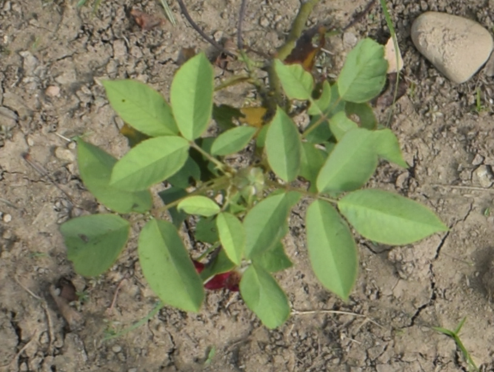
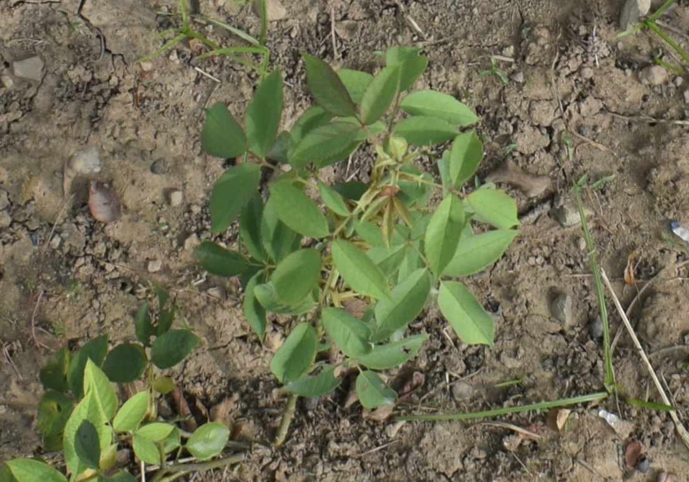
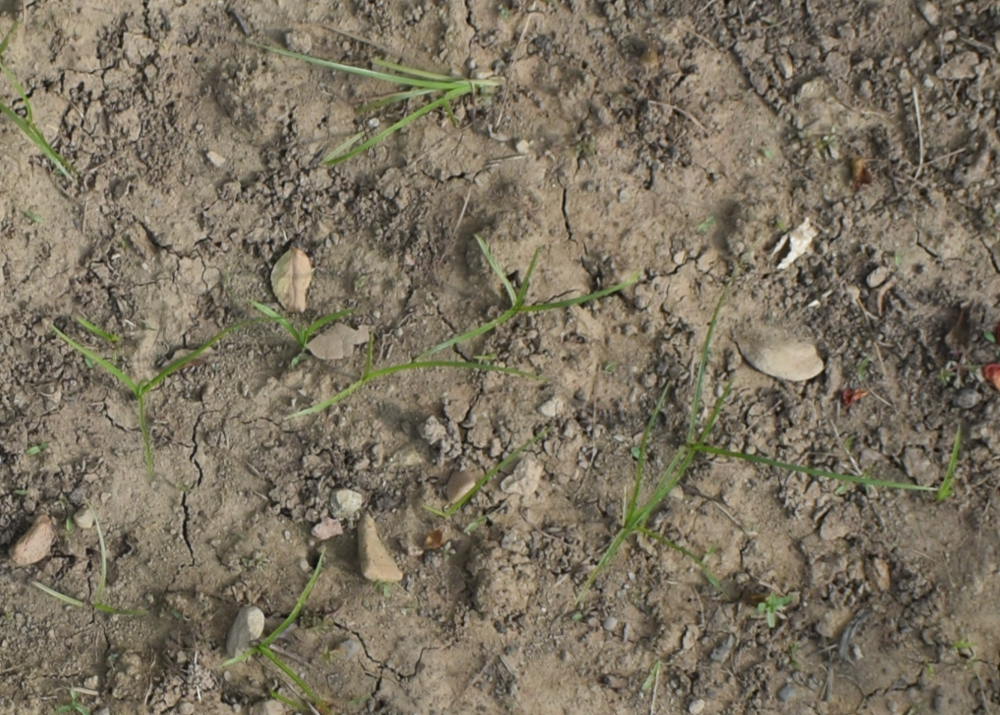

# Botanic Mixed Set

A Simplified Plant Image Segmentation Dataset for Effective Benchmarking.

## Overview

This repository contains a Plant Image Segmentation Dataset, "Botanic Mixed Set" designed for use in computer vision and image segmentation tasks. The dataset consists of 47 plant images along with corresponding masks for pixel-level segmentation.

**Note:** Only 7 sample images are available directly on GitHub due to space constraints. If you need access to the entire dataset, please contact via email.

## Dataset Structure

- `Image/`: This directory contains 7 sample plant images in PNG format.

- `Mask/`: Corresponding masks for the sample images in PNG format.

## Sample Images

 |  | 
--- | --- | ---
*Sample Image 1* | *Sample Image 2* | *Sample Image 3*

## Sample Masks

 |  | 
--- | --- | ---
*Sample Mask 1* | *Sample Mask 2* | *Sample Mask 3*

## Usage

1. Clone the repository:

    ```bash
    git clone https://github.com/mukund-ks/botanic-mixed-set.git
    ```

2. Explore the sample images and masks in the `Image/` and `Mask/` directories.

## Citation

If you use this dataset in your research or project, please consider citing:

```bibtex
@misc{mukund-ks:botanic-mixed-set,
  title={Botanic Mixed Set},
  author={Surehli, Mukund Kumar and Aggarwal, Naveen and Joshi, Garima},
  year={2023},
  publisher={GitHub},
  howpublished={\url{https://github.com/mukund-ks/botanic-mixed-set.git}},
}
```

## Contact

For inquiries regarding the dataset, please contact:

Mukund Kumar Surehli

mukund.28.k@gmail.com